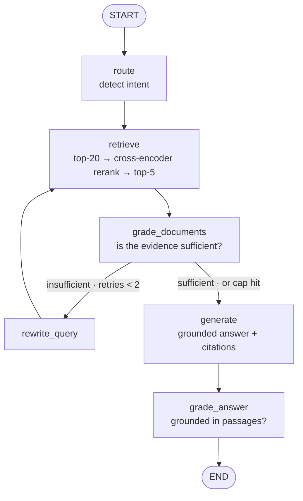

# Medical Reference Agent

A self-correcting RAG agent that answers medical questions from **491,497 peer-reviewed clinical references** (StatPearls + USMLE textbooks), cites every claim, and refuses what it can't ground.

> Educational summaries from published references — **not medical advice**. For personal symptoms, consult a clinician.

## Demo

<!-- To get an inline player on the repo page: open any issue in this repo, drag your
     video file into the comment box, wait for it to upload, then copy the generated
     https://github.com/user-attachments/assets/... URL and paste it on its own line
     below (replacing PASTE_VIDEO_URL_HERE). GitHub renders a bare user-attachments
     URL as a native inline video player. -->

(https://github.com/user-attachments/assets/b0d0c586-799d-4ec6-b763-5939f8a9c776)

Watch it grade its own evidence, rewrite a weak query, and answer with citations.

## What it does

Most "chat with documents" systems do one retrieve-then-answer pass and hope the retrieval was good. This one **inspects its own evidence and changes strategy when it's weak** — then it's measured on a real academic benchmark (MIRAGE), not just eyeballed.

- **Grounded + cited** — every answer is built only from retrieved passages, each claim tagged to its source (`[statpearls: ...]`, `[textbook: ...]`).
- **Refuses honestly** — out-of-scope questions return a fixed refusal instead of hallucinating; personal-symptom questions defer to a clinician.
- **Self-correcting** — if the retrieved passages don't actually answer the question, the agent rewrites its query and retrieves again (hard-capped at 2 retries).

## How it works



A real trace — *"I have chest pain right now, what should I do?"*:

```
1. Routed: medical question, retrieval needed
2. Retrieved 5 passages
3. Doc grade: NO — passages cover treatment/evaluation but don't address
   immediate guidance for someone currently experiencing symptoms
4. Rewrote query → "appropriate steps for acute chest pain + first-line
   treatment for underlying conditions (MI, pneumonia)…"
5. Retrieved 5 passages
6. Doc grade: YES
7. Generated → opens with "seek emergency care," then a cited summary
8. Answer grounded: YES        [statpearls: Chest Pain — ACS] [InternalMed_Harrison]
                                              10.2s · $0.003 · 1 retry
```

A vanilla pipeline stops at step 3 with a weak answer. The agent notices *why* retrieval failed, repairs the query, and lands a grounded one — with the whole decision path visible.

## Results

### MIRAGE benchmark — embedding ablation (the headline)

Accuracy on the three [MIRAGE](https://github.com/Teddy-XiongGZ/MIRAGE) exam tasks this corpus covers, run through the agent in MCQ mode (30 q/task, agent = Groq `llama-3.1-8b-instant`, everything held fixed except the embedder):

| Task | general (nomic) | MedCPT (domain) | Δ |
|---|---|---|---|
| MMLU-Med | **70.00** | 63.33 | −6.67 |
| MedQA-US | **60.00** | 56.67 | −3.33 |
| MedMCQA | **56.67** | 53.33 | −3.34 |
| **Exam mean** | **62.22** | 57.78 | **−4.44** |

### The finding I didn't expect

The **domain-specific** medical encoder (MedCPT) **lost** to the general one. A retrieval-only probe shows why:

| Signal (top-5, reranked) | general | MedCPT | Δ |
|---|---|---|---|
| StatPearls hit-rate | 0.665 | **0.771** | +0.106 |
| reranker score (mean) | **0.817** | −1.023 | −1.840 |

MedCPT surfaces **more** clinical content (+0.106) — but the general-domain cross-encoder reranker downstream scores its passages far lower. **The pipeline rewards alignment across stages more than per-stage domain specialization.** A real, non-obvious systems result, kept honestly rather than buried.

*For orientation only (not head-to-head — they used a larger corpus + generator): published baselines are GPT-3.5 ≈ 71.6, Llama2-70B ≈ 53.4. A 7-8B agent on a textbooks+StatPearls subset landing at 62.2 sits sensibly between them.*

### Answer quality (RAGAS)

| Metric | Score | n |
|---|---|---|
| Faithfulness | 0.793 | 6 |
| Answer relevancy | 0.924 | 5 |
| Context precision | 0.775 | 6 |

Scored by a fixed judge (Groq 70B, temp 0). Partial — the free-tier daily token cap stopped scoring at ~6 rows; the harness is resumable. Treat as a regression signal, not ground truth.

## The corpus

| Source | Snippets | What it is |
|---|---|---|
| StatPearls | 365,650 | Point-of-care clinical decision support |
| Textbooks | 125,847 | 18 USMLE medical textbooks |
| **Total** | **491,497** | embedded with `nomic-embed-text-v1.5` |

PubMed is **not** ingested (its 23.9M snippets are infeasible on a 6 GB GPU), so PubMed-specific MIRAGE tasks are reported separately and expected low — an honest corpus boundary, not a regression.

## Run it

```bash
git clone https://github.com/gouravshokeen/medical-rag-agent.git
cd medical-rag-agent && uv sync

# build the index once (resumable, ~hours on a consumer GPU)
python ingest/build_medical_index.py

# ask a question (set LLM_PROVIDER=groq + GROQ_API_KEY in .env for fast answers)
cp .env.example .env
uv run python -m agent.run "What are common adverse effects of ACE inhibitors?"

# API + web UI
uv run uvicorn app.main:app --port 8000
cd frontend && npm install && npm run dev   # → localhost:3000
```

**LLM providers:** `LLM_PROVIDER=groq` (fast, ~7s/answer) or `ollama` (local, free, slow). Embeddings always run locally.

## Stack

LangGraph · LangChain 0.3.x · Chroma · `nomic-embed-text` + `MedCPT` (ablation) · `ms-marco-MiniLM` reranker · Groq / Ollama · RAGAS + DeepEval · Langfuse tracing · FastAPI + Next.js · `uv`

## Honest limitations

- **MIRAGE is a 30 q/task sample**, not the full benchmark — read the *direction* of the ablation, not the third decimal.
- **The agent is 7-8B**, chosen for free-tier quota; a larger model would likely score higher. The ablation holds everything fixed except the embedder, so model size doesn't bias the finding.
- **RAGAS scores are over ~6 rows** — real but thin.
- **Self-correction fixes vague queries, not missing data** — if the corpus lacks the answer, the agent exhausts its retries and refuses.

---

Built by Gourav Shokeen.