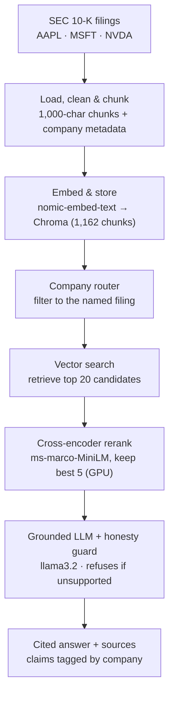
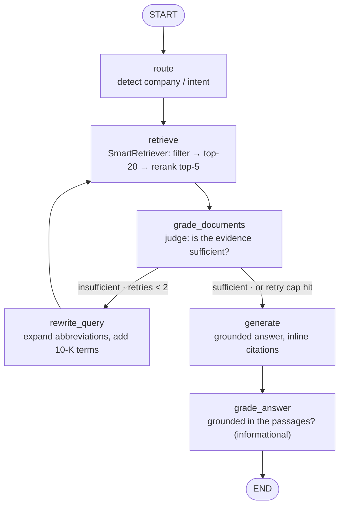

# SEC 10-K Q&A — RAG with Cross-Encoder Reranking

Ask natural-language questions about real **SEC 10-K annual filings** (Apple, Microsoft, NVIDIA) and get **cited, source-grounded answers**. The system runs entirely locally — embeddings, retrieval, reranking, and the LLM — on a single consumer GPU.

The point of this project isn't "chat with a PDF." It's that retrieval quality was **measured**, a failure mode was found (the naive retriever returned the wrong company's text more than half the time), and it was **fixed with real information-retrieval technique** — taking company-attribution precision from **0.45 → 0.97** on a hand-built test set.

> **Headline result:** retrieval precision improved from **0.45 to 0.97** by adding a cross-encoder reranker and company-aware query routing — measured before and after, on the same test set.

<!-- TODO: add a screenshot of a cited answer here — it's the single most convincing thing a reader sees -->
<!--  -->

## Architecture



The first two stages run **once** to build the index. The rest runs **per question**.

## The agentic layer (LangGraph)

On top of the retriever sits a **self-correcting agent** (`agent/`). Instead of one retrieve→generate pass, the agent grades its own evidence and rewrites its query when retrieval comes back weak:



The rewrite loop is **hard-capped at 2 retries** — no unbounded loops. Every node appends to a `reasoning_steps` log that the API and UI surface verbatim.

**What makes it agentic** — the system inspects its own intermediate results and changes strategy. A real trace (local llama3.1:8b):

```
Q: "What did Tim Cook's company report for revenue?"
1. Routed: detected company=none (searching all filings), retrieval needed
2. Retrieved 5 candidate passages
3. Doc grade: no — The passages provided do not mention Tim Cook's company...
4. Rewrote query (attempt 1): What are the net sales reported by Apple in its
   Management's Discussion and Analysis section of the 10-K filing?
5. Retrieved 5 candidate passages
6. Doc grade: yes — The passages provide detailed financial information...
7. Generated answer            → "$416,161 million in 2025. [AAPL, 48]"
8. Answer grounded: yes
```

A vanilla RAG pipeline returns "I don't know" at step 3. The agent notices *why* it failed (vague query), repairs the query, and lands a cited, grounded answer — with the whole decision path visible.

Unanswerable questions ("What is Apple's CEO's home address?") exhaust the retry cap and return exactly: *"This information is not available in the filings."* — refusal, not hallucination.

**LLM providers:** every node gets its model from `agent/llm_provider.py` — `LLM_PROVIDER=ollama` (local llama3.1:8b, free) or `LLM_PROVIDER=groq` (llama-3.3-70b-versatile, fast). Query embeddings always stay local (the index was built with nomic-embed-text).

## Evaluation harness

Two complementary layers, both scored by **one fixed judge** (Groq llama-3.3-70b-versatile, temperature 0 — never changed mid-project, so scores stay comparable). RAGAS answer-relevancy embeddings are local MiniLM, so no embeddings API key is needed.

- **`evals/run_eval.py`** — RAGAS (faithfulness, answer relevancy, context precision) over the golden set in `evals/golden/golden.jsonl`; writes timestamped JSON + CSV to `evals/results/`.
- **`evals/test_quality.py`** — DeepEval regression gate on the `smoke: true` subset; runs in CI on every PR (`.github/workflows/eval.yml`). Thresholds (faithfulness ≥ 0.80, answer relevancy ≥ 0.75, hallucination ≤ 0.15) are deliberately below expected performance: the gate catches *regressions*, not perfection.

| Metric (RAGAS, golden set) | Average |
|---|---|
| Faithfulness | _TBD — fill from `evals/results/`_ |
| Answer relevancy | _TBD_ |
| Context precision | _TBD_ |

## Serving it

- **API** — `uvicorn app.main:app --port 8000` → `POST /ask {"question": ...}` returns the answer **plus the full reasoning path**, citations, groundedness, latency, and estimated cost (token usage × configurable Groq rates; `null` on local Ollama, which has no metered cost).
- **Web UI** — `frontend/` is a single-page Next.js 14 app: ask a question, see the answer, the agent's numbered reasoning steps (the hero of the page), citation chips, and latency/cost labels. `app/gradio_app.py` is a one-file fallback UI.
- **Deploy** — Dockerfile targets a Hugging Face Docker Space (embedding model baked in, Groq for generation); frontend goes to Vercel with one env var. Exact steps: [deploy/DEPLOY.md](deploy/DEPLOY.md).

## Observability (Langfuse)

Set `LANGFUSE_PUBLIC_KEY`, `LANGFUSE_SECRET_KEY`, `LANGFUSE_HOST` in `.env` and every run produces a full trace (each node's LLM calls, latencies, token counts) plus a `trace_url` in the API response. Without keys the agent runs untraced — one warning, no crash.

**Cost tracking note:** Langfuse only computes dollar cost for models whose pricing it knows. For the Groq judge/agent model, add a custom model entry in *Langfuse → Settings → Models* (match `llama-3.3-70b-versatile`, input $0.59/1M, output $0.79/1M as of mid-2026) — otherwise traces show token counts but no cost.

<!-- TODO: screenshot of a Langfuse trace here -->
<!--  -->

## Benchmark

Measured on a hand-built test set of graded questions (easy, hard-numeric, cross-company, and unanswerable) against the *same* questions for every configuration.

| Configuration | Hit-rate | Company precision | Avg latency |
|---|---|---|---|
| Baseline (vector top-k) | 0.93 | 0.45 | ~45 ms |
| + Cross-encoder reranking | 1.00 | 0.63 | ~112 ms |
| + Company-aware routing | 1.00 | **0.97** | ~121 ms |

**Reading the table:** company precision is the headline — naive vector search pulled the wrong company's chunks 55% of the time, because every 10-K's risk and finance language reads almost identically. Reranking removes boilerplate; routing filters retrieval to the named company, which is why precision approaches (but doesn't hit) 1.0. Latency rises modestly — the honest cost of the accuracy gain, and small because reranking runs on the GPU.

## How it works

**Indexing.** Each filing's primary HTML document is cleaned (stripped of markup), split into 1,000-character chunks with 200-character overlap, and tagged with `company` metadata. Chunks are embedded with a local `nomic-embed-text` model and stored in a persistent Chroma vector database.

**Company router.** When a question names a company ("What are *Apple's* risk factors?"), retrieval is filtered to that company's chunks before searching — making wrong-company results structurally impossible. Questions naming multiple companies retrieve from each; ambiguous questions fall back to searching everything.

**Cross-encoder reranking.** A wide candidate pool (top 20) is retrieved cheaply, then a cross-encoder re-reads each *(question, chunk)* pair jointly and keeps only the best 5. This is the single highest-impact upgrade — it discards chunks that merely *mention* a keyword in favor of chunks that actually *answer* the question.

**Grounded generation + honesty guard.** Retrieved chunks are passed to a local `llama3.2` model with a prompt that answers *only* from the provided context and cites the company per claim. If no chunk is close enough to the question (distance threshold), the system refuses rather than hallucinating — important for finance.

## Stack

- **Orchestration:** LangChain (pinned to 0.3.x — see `DECISIONS.md`)
- **Embeddings:** `nomic-embed-text` via Ollama (local)
- **Vector store:** Chroma (persistent, on disk)
- **Reranker:** `cross-encoder/ms-marco-MiniLM-L-6-v2` (sentence-transformers, GPU)
- **LLM:** `llama3.2` via Ollama (local)
- **Data:** SEC EDGAR 10-K filings via `sec-edgar-downloader`
- **Tooling:** `uv` for environment + lockfile

Everything runs locally and free — no API keys, no rate limits.

## Setup

**Prerequisites:**
- [uv](https://docs.astral.sh/uv/) for Python + dependency management
- [Ollama](https://ollama.com/) running, with the two models pulled:
  ```bash
  ollama pull nomic-embed-text
  ollama pull llama3.2
  ```
- (Optional) An NVIDIA GPU for the reranker. CPU works but is slower. For GPU, torch is pinned to a CUDA build in `pyproject.toml`.

**Install:**
```bash
git clone https://github.com/gouravshokeen/rag-finance.git
cd rag-finance
uv sync
```

**Download the filings** (SEC requires a real name + email in the user-agent):
```bash
uv run get_filings.py
```

**Run the notebook:**
```bash
uv run jupyter lab
```
Open `rag.ipynb` and run the cells top to bottom. The index builds once (a few minutes on GPU); later runs load it from disk.

**Run the agent** (after the index exists):
```bash
cp .env.example .env          # set LLM_PROVIDER (+ GROQ_API_KEY if groq)
uv run python -m agent.run "What was Apple's total net sales in fiscal 2023?"
```

**Run the evals:**
```bash
uv run python evals/run_eval.py        # RAGAS, full golden set
uv run pytest evals/test_quality.py    # DeepEval smoke gate
```

**Run the API + frontend:**
```bash
uv run uvicorn app.main:app --port 8000
cd frontend && cp .env.local.example .env.local && npm install && npm run dev
# open http://localhost:3000
```

## Evaluation & limitations

These numbers are honest about their scope:

- The test set is **small and hand-built** (~23 graded questions across three filings). The results show the approach works *on these filings*, not a generalized benchmark.
- **Company precision of 0.97 is high partly by construction** — metadata filtering guarantees correct-company retrieval for questions that name a company. The genuine retrieval work shows up on questions that *don't* name a company, where the reranker still surfaces the right content.
- **Hybrid (vector + BM25) search was tried and dropped.** On these filings, BM25 introduced boilerplate noise that *lowered* precision, so the pipeline uses vector retrieval + reranking instead. The reasoning is documented in `DECISIONS.md` — a measured negative result, kept honestly.

And for the agentic layer specifically:

- **LLM-judge variance is real.** RAGAS/DeepEval scores come from a judge LLM; the judge is fixed (one model, temperature 0) to keep runs comparable, but absolute numbers still carry judge bias — treat them as a regression signal, not ground truth.
- **The golden set is ~12–15 questions.** Big enough to catch breakage, far too small for statistical claims.
- **Cost is estimated**, not billed: token usage × published Groq per-token rates (configurable). Local Ollama runs report no cost because there is none to meter.
- **The self-correction loop helps vague queries, not missing data.** If the filings genuinely lack the answer, the agent burns its 2 retries and refuses — that's the designed behavior, but it means retries aren't free for hopeless questions.

## Repo layout

```
rag-finance/
├── get_filings.py        # one-time: download 10-Ks from SEC EDGAR
├── rag.ipynb             # phase 1: the retrieval pipeline, cell by cell
├── agent/                # phase 2: LangGraph agent
│   ├── graph.py          #   the state machine + run_agent() entry point
│   ├── retriever.py      #   SmartRetriever (from rag.ipynb) over the persisted index
│   ├── llm_provider.py   #   LLM_PROVIDER switch: ollama | groq
│   ├── tracing.py        #   Langfuse (version-aware, graceful without keys)
│   └── run.py            #   CLI: python -m agent.run "question"
├── evals/                # phase 3: evaluation
│   ├── golden/golden.jsonl   # golden Q&A set (edit me!)
│   ├── judge.py          #   THE fixed judge (RAGAS + DeepEval wrappers)
│   ├── run_eval.py       #   RAGAS runner → evals/results/
│   └── test_quality.py   #   DeepEval smoke gate (runs in CI)
├── app/                  # serving
│   ├── main.py           #   FastAPI: POST /ask, GET /health
│   └── gradio_app.py     #   one-file fallback UI
├── frontend/             # Next.js 14 single-page UI
├── deploy/DEPLOY.md      # HF Spaces + Vercel, step by step
├── Dockerfile            # backend image (HF Docker Space compatible)
├── pyproject.toml        # dependencies (LangChain pinned 0.3.x, CUDA torch)
├── uv.lock               # reproducible environment
├── README.md
└── DECISIONS.md          # why each architectural choice was made
```

---

Built by Gourav Shokeen.
