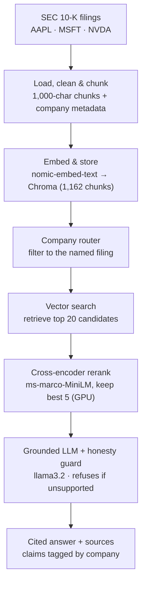

# SEC 10-K Q&A — RAG with Cross-Encoder Reranking

Ask natural-language questions about real **SEC 10-K annual filings** (Apple, Microsoft, NVIDIA) and get **cited, source-grounded answers**. The system runs entirely locally — embeddings, retrieval, reranking, and the LLM — on a single consumer GPU.

The point of this project isn't "chat with a PDF." It's that retrieval quality was **measured**, a failure mode was found (the naive retriever returned the wrong company's text more than half the time), and it was **fixed with real information-retrieval technique** — taking company-attribution precision from **0.45 → 0.97** on a hand-built test set.

> **Headline result:** retrieval precision improved from **0.45 to 0.97** by adding a cross-encoder reranker and company-aware query routing — measured before and after, on the same test set.

<!-- TODO: add a screenshot of a cited answer here — it's the single most convincing thing a reader sees -->
<!--  -->

## Architecture



The first two stages run **once** to build the index. The rest runs **per question**.

## Benchmark

Measured on a hand-built test set of graded questions (easy, hard-numeric, cross-company, and unanswerable) against the *same* questions for every configuration.

| Configuration | Hit-rate | Company precision | Avg latency |
|---|---|---|---|
| Baseline (vector top-k) | 0.93 | 0.45 | ~45 ms |
| + Cross-encoder reranking | 1.00 | 0.63 | ~112 ms |
| + Company-aware routing | 1.00 | **0.97** | ~121 ms |

**Reading the table:** company precision is the headline — naive vector search pulled the wrong company's chunks 55% of the time, because every 10-K's risk and finance language reads almost identically. Reranking removes boilerplate; routing filters retrieval to the named company, which is why precision approaches (but doesn't hit) 1.0. Latency rises modestly — the honest cost of the accuracy gain, and small because reranking runs on the GPU.

## How it works

**Indexing.** Each filing's primary HTML document is cleaned (stripped of markup), split into 1,000-character chunks with 200-character overlap, and tagged with `company` metadata. Chunks are embedded with a local `nomic-embed-text` model and stored in a persistent Chroma vector database.

**Company router.** When a question names a company ("What are *Apple's* risk factors?"), retrieval is filtered to that company's chunks before searching — making wrong-company results structurally impossible. Questions naming multiple companies retrieve from each; ambiguous questions fall back to searching everything.

**Cross-encoder reranking.** A wide candidate pool (top 20) is retrieved cheaply, then a cross-encoder re-reads each *(question, chunk)* pair jointly and keeps only the best 5. This is the single highest-impact upgrade — it discards chunks that merely *mention* a keyword in favor of chunks that actually *answer* the question.

**Grounded generation + honesty guard.** Retrieved chunks are passed to a local `llama3.2` model with a prompt that answers *only* from the provided context and cites the company per claim. If no chunk is close enough to the question (distance threshold), the system refuses rather than hallucinating — important for finance.

## Stack

- **Orchestration:** LangChain (pinned to 0.3.x — see `DECISIONS.md`)
- **Embeddings:** `nomic-embed-text` via Ollama (local)
- **Vector store:** Chroma (persistent, on disk)
- **Reranker:** `cross-encoder/ms-marco-MiniLM-L-6-v2` (sentence-transformers, GPU)
- **LLM:** `llama3.2` via Ollama (local)
- **Data:** SEC EDGAR 10-K filings via `sec-edgar-downloader`
- **Tooling:** `uv` for environment + lockfile

Everything runs locally and free — no API keys, no rate limits.

## Setup

**Prerequisites:**
- [uv](https://docs.astral.sh/uv/) for Python + dependency management
- [Ollama](https://ollama.com/) running, with the two models pulled:
  ```bash
  ollama pull nomic-embed-text
  ollama pull llama3.2
  ```
- (Optional) An NVIDIA GPU for the reranker. CPU works but is slower. For GPU, torch is pinned to a CUDA build in `pyproject.toml`.

**Install:**
```bash
git clone https://github.com/gouravshokeen/rag-finance.git
cd rag-finance
uv sync
```

**Download the filings** (SEC requires a real name + email in the user-agent):
```bash
uv run get_filings.py
```

**Run the notebook:**
```bash
uv run jupyter lab
```
Open `rag.ipynb` and run the cells top to bottom. The index builds once (a few minutes on GPU); later runs load it from disk.

## Evaluation & limitations

These numbers are honest about their scope:

- The test set is **small and hand-built** (~23 graded questions across three filings). The results show the approach works *on these filings*, not a generalized benchmark.
- **Company precision of 0.97 is high partly by construction** — metadata filtering guarantees correct-company retrieval for questions that name a company. The genuine retrieval work shows up on questions that *don't* name a company, where the reranker still surfaces the right content.
- **Hybrid (vector + BM25) search was tried and dropped.** On these filings, BM25 introduced boilerplate noise that *lowered* precision, so the pipeline uses vector retrieval + reranking instead. The reasoning is documented in `DECISIONS.md` — a measured negative result, kept honestly.

## Repo layout

```
rag-finance/
├── get_filings.py        # one-time: download 10-Ks from SEC EDGAR
├── rag.ipynb             # the full pipeline, cell by cell
├── pyproject.toml        # dependencies (LangChain pinned 0.3.x, CUDA torch)
├── uv.lock               # reproducible environment
├── README.md
└── DECISIONS.md          # why each architectural choice was made
```

---

Built by Gourav Shokeen.
